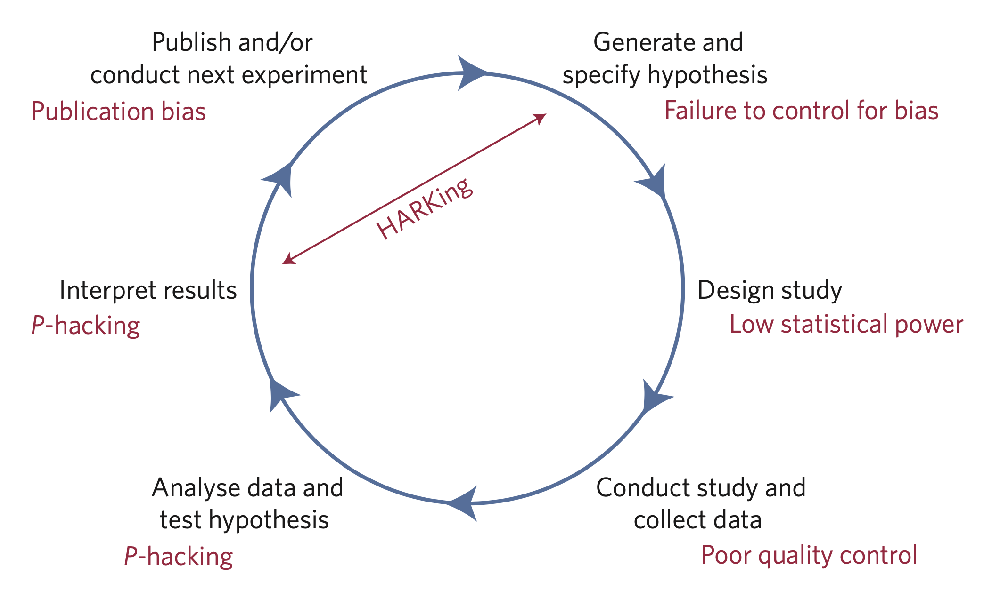

# Intro: Nosek et al. (2018)

[Paper](https://doi.org/10.1073/pnas.1708274114)

---

## Main points

- postdiction v. prediction
- reward circle in science (novelty over incremental increase in knowledge)
- 

---




---

## Fragments

Make content appear incrementally

```
{} One {}
{} **Two** {}
{} Three {}
```

Press `Space` to play!

{} One {}
{} **Two** {}
{} Three {}

---



## Custom Slide

Customize the slide style and background

```markdown



```
---

# Next Paper?

[Ask](https://github.com/wowchemy/wowchemy-hugo-modules/discussions)


